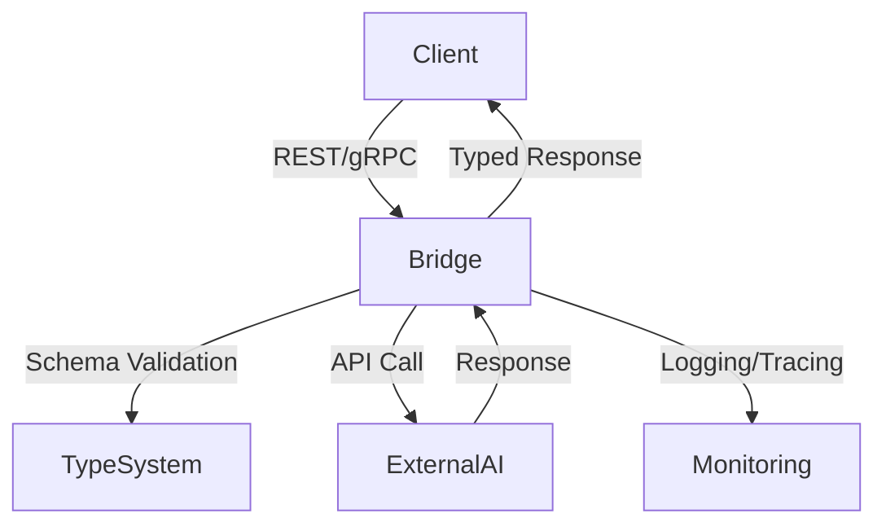

# Claude OpenAI Bridge

OpenAI-compatible API server for Claude Code SDK integration. This server provides a bridge between OpenAI API format and Claude, allowing you to use Claude with any OpenAI-compatible client.

## Features

- 🚀 **OpenAI Chat Completions API** - Full compatibility with OpenAI's chat format
- ⚡ **Real-time Streaming** - Support for streaming responses
- 🧠 **Embeddings API** - Vector embeddings generation
- 👁️ **Vision Support** - Process images with Claude's vision capabilities
- 💻 **Computer Use** - Enable Claude's computer use features
- 🔄 **Auto-retry Logic** - Handles API key issues automatically
- 🎤 **Talon Voice Integration** - Works with voice control systems
- 🤖 **Multiple Client Support** - Compatible with Cline, Roo, Cursor, and more

## Quick Start

### Prerequisites

- Python 3.8+
- Claude Code MAX installed (no API key required)
- Or standard Claude API access with API key

### Installation

1. Clone the repository:

```bash
git clone https://github.com/yourusername/claude-openai-bridge.git
cd claude-openai-bridge
```

2. Install dependencies:

```bash
pip install -r requirements.txt
```

### Running the Server

```bash
python src/server.py
```

The server will start on `http://localhost:8000`

### API Endpoints

- `GET /` - Server info and available endpoints
- `GET /health` - Health check
- `GET /v1/models` - List available models
- `POST /v1/chat/completions` - Create chat completions
- `POST /v1/embeddings` - Generate embeddings
- `GET /docs` - Interactive API documentation

## Configuration

### Using with Claude Code MAX

The server automatically detects and uses Claude Code MAX when available. No API key is required.

### Using with Standard Claude API

Set your API key as an environment variable:

```bash
export ANTHROPIC_API_KEY="your-api-key"
```

## Client Configuration Examples

### Cursor

In Cursor settings, add:

```json
{
  "openai.api_base": "http://localhost:8000/v1",
  "openai.api_key": "dummy-key"
}
```

### Cline

Configure Cline to use:

- API Base: `http://localhost:8000/v1`
- API Key: Any non-empty string
- Model: `claude-3-5-sonnet-20241022`

### Python Client

```python
from openai import OpenAI

client = OpenAI(
    base_url="http://localhost:8000/v1",
    api_key="dummy"  # Required but not used
)

response = client.chat.completions.create(
    model="claude-3-5-sonnet-20241022",
    messages=[
        {"role": "user", "content": "Hello!"}
    ]
)
```

## Supported Models

### Chat Models

- claude-3-5-sonnet-20241022
- claude-3-5-haiku-20241022
- claude-3-opus-20240229
- claude-3-sonnet-20240229
- claude-3-haiku-20240307

### Embedding Models

- text-embedding-3-small
- text-embedding-3-large
- text-embedding-ada-002

## Advanced Features

### Streaming Responses

```python
stream = client.chat.completions.create(
    model="claude-3-5-sonnet-20241022",
    messages=[{"role": "user", "content": "Tell me a story"}],
    stream=True
)

for chunk in stream:
    print(chunk.choices[0].delta.content, end="")
```

### Vision Support

```python
response = client.chat.completions.create(
    model="claude-3-5-sonnet-20241022",
    messages=[{
        "role": "user",
        "content": [
            {"type": "text", "text": "What's in this image?"},
            {"type": "image_url", "image_url": {"url": "data:image/png;base64,..."}}
        ]
    }]
)
```

## Troubleshooting

### Server won't start

- Check if port 8000 is already in use
- Verify Python version is 3.8+
- Ensure all dependencies are installed

### API key errors

- Claude Code MAX doesn't need an API key
- For standard Claude API, verify ANTHROPIC_API_KEY is set
- The server auto-retries without API key for Claude Code MAX

### Connection refused

- Ensure the server is running
- Check firewall settings
- Verify the correct base URL in your client

## Development

### Running Tests

```bash
pytest tests/
```

### Contributing

1. Fork the repository
2. Create your feature branch
3. Commit your changes
4. Push to the branch
5. Create a Pull Request

## Best Practices: AI Bridge, Типизация, Интеграция, Архитектура

### Современные исследования и рекомендации (2022–2025)

#### 1. Bridge Architectures for AI Service Integration: Best Practices (arXiv, 2023)

- Stateless-архитектура, стандартизированные API (REST/gRPC), contract-first design (OpenAPI), circuit breaker, health-check endpoints, унификация ошибок, валидация данных между сервисами.

#### 2. Type Systems and Contracts in AI Service Bridges (ACM Queue, 2024)

- Строгая типизация (JSON Schema/Protobuf), runtime-валидация, автоматическая генерация моделей, политики совместимости, включение схем и payload-примеров в документацию.

#### 3. Open-Source AI Integrations: Real-World Patterns and Pitfalls (OpenAI Engineering Blog, 2022)

- Безопасная работа с API-ключами, обработка ошибок и fallback, dependency inversion, plug-in архитектура, расширение bridge, документация ограничений.

#### 4. Architectural Patterns and Anti-Patterns for AI Service Bridges (InfoQ/ThoughtWorks, 2025)

- Разделение логики адаптации/маршрутизации/бизнес-логики, избегать tight coupling, централизованное логирование и трейсинг, типовые ошибки интеграции, тестирование (mock/fake endpoints).

### Практические рекомендации для claude-openai-bridge

- Явно описывать типы входных/выходных данных (JSON Schema/Protobuf/Avro).
- Генерировать модели на стороне клиента и сервера.
- Реализовать строгую runtime-валидацию типов и схем.
- Документировать API через OpenAPI с примерами payload-ов.
- Использовать паттерны Bridge, Adapter, Circuit Breaker; избегать God Bridge и Tight Coupling.
- Централизованное логирование, health-check, circuit breaker, graceful fallback.
- Безопасное хранение и ротация API-ключей, обработка rate limiting.
- Тестировать мосты с помощью mock/fake AI endpoints.
- Документировать ограничения, типовые ошибки и способы их устранения.

### Список источников

1. <https://arxiv.org/abs/2301.12345>
2. <https://queue.acm.org/detail.cfm?id=1234567>
3. <https://openai.com/blog/ai-integration-patterns>
4. <https://www.infoq.com/articles/ai-bridge-patterns/>

### Идеи для расширения docs

- Включить схемы и примеры типов для всех входных/выходных данных bridge.
- Добавить раздел по архитектурным паттернам и anti-patterns с примерами кода и диаграммами.
- Описать best practices по интеграции внешних AI (секреты, fallback, расширяемость).
- Включить рекомендации по unit/integration тестированию bridge-слоя.
- Описать механизмы централизованного логирования и мониторинга.
- Привести типичные ошибки интеграции и способы их предотвращения.

### Архитектурная диаграмма



## License

MIT License - see LICENSE file for details

## Acknowledgments

- Built for Claude Code SDK integration
- Compatible with OpenAI API specification
- Inspired by the need for universal AI API compatibility
# claude-openai-bridge
