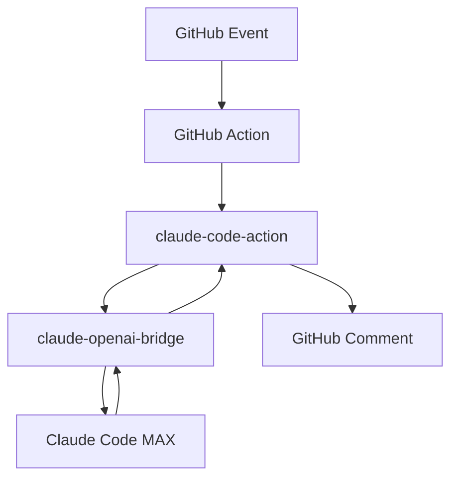

# GitHub Integration Guide

Полное руководство по интеграции claude-openai-bridge с GitHub Actions и claude-code-action.

## Оглавление

1. [Обзор архитектуры](#обзор-архитектуры)
2. [Установка и настройка](#установка-и-настройка)
3. [Конфигурация GitHub Action](#конфигурация-github-action)
4. [API Endpoints](#api-endpoints)
5. [Безопасность](#безопасность)
6. [Примеры использования](#примеры-использования)
7. [Устранение неполадок](#устранение-неполадок)
8. [Расширенные сценарии](#расширенные-сценарии)

## Обзор архитектуры

### Компоненты системы



### Поток данных

1. **GitHub Event** - Issue comment, PR creation, etc.
2. **GitHub Action** - Триггер workflow
3. **claude-code-action** - Обработка события и формирование запроса
4. **claude-openai-bridge** - Конвертация в Claude формат
5. **Claude Code MAX** - Генерация ответа
6. **Обратный поток** - Возврат ответа в GitHub

### Ключевые особенности

- **OpenAI совместимость** - полная совместимость с OpenAI API
- **Claude Code MAX** - использование без API ключа
- **Безопасность** - проверка webhook подписей
- **Контекстный анализ** - анализ PR diff и метаданных
- **Гибкая настройка** - конфигурируемые триггеры и поведение

## Установка и настройка

### Предварительные требования

1. **Claude Code MAX подписка**
2. **Self-hosted GitHub runner** или доступ к локальному серверу
3. **Python 3.11+**
4. **Git** для работы с репозиториями

### Шаг 1: Клонирование репозитория

```bash
git clone https://github.com/eagurin/claude-openai-bridge.git
cd claude-openai-bridge
```

### Шаг 2: Установка зависимостей

```bash
pip install -r requirements.txt
```

### Шаг 3: Конфигурация переменных окружения

Создайте файл `.env`:

```bash
# Основные настройки
GITHUB_WEBHOOK_SECRET=your_webhook_secret_here
GITHUB_TOKEN=ghp_your_github_token_here

# Настройки безопасности (опционально)
REQUIRE_WEBHOOK_SIGNATURE=true
GITHUB_INTEGRATION_ENABLED=true

# Claude настройки (обычно не требуется для Claude Code MAX)
# ANTHROPIC_API_KEY=your_api_key_here
```

### Шаг 4: Запуск сервера

```bash
python src/server.py
```

Сервер будет доступен на `http://localhost:8000`

## Конфигурация GitHub Action

### Базовая конфигурация

Создайте файл `.github/workflows/claude-assistant.yml`:

```yaml
name: Claude Assistant

on:
  issue_comment:
    types: [created]
  pull_request:
    types: [opened, synchronize]

permissions:
  contents: read
  issues: write
  pull-requests: write

jobs:
  claude-assistant:
    runs-on: self-hosted
    
    # Условие: отвечаем только на триггерные фразы
    if: |
      github.event_name == 'pull_request' ||
      (github.event_name == 'issue_comment' && 
       (contains(github.event.comment.body, '@claude') ||
        contains(github.event.comment.body, '/review')))
    
    steps:
      - uses: actions/checkout@v4
        with:
          fetch-depth: 0
          
      - name: Claude Code Action
        uses: anthropics/claude-code-action@v1
        with:
          claude_api_base: 'http://localhost:8000/v1'
          model: 'claude-3-5-sonnet-20241022'
          system_prompt: |
            You are Claude, integrated with GitHub via claude-openai-bridge.
            Provide helpful code reviews and suggestions in GitHub Markdown format.
        env:
          GITHUB_TOKEN: ${{ secrets.GITHUB_TOKEN }}
```

### Расширенная конфигурация

```yaml
name: Advanced Claude Assistant

on:
  issue_comment:
    types: [created]
  pull_request:
    types: [opened, synchronize, reopened]
  issues:
    types: [opened, labeled]

permissions:
  contents: read
  issues: write
  pull-requests: write
  checks: read

jobs:
  claude-assistant:
    runs-on: self-hosted
    
    strategy:
      matrix:
        scenario:
          - name: "code_review"
            condition: "github.event_name == 'pull_request'"
            model: "claude-3-5-sonnet-20241022"
          - name: "issue_help"
            condition: "github.event_name == 'issues'"
            model: "claude-3-5-haiku-20241022"
    
    steps:
      - uses: actions/checkout@v4
      
      # Проверка доступности bridge
      - name: Check Bridge Health
        run: |
          curl -f http://localhost:8000/health || {
            echo "Starting bridge..."
            nohup python src/server.py &
            sleep 10
          }
      
      # Настройка в зависимости от сценария
      - name: Configure for ${{ matrix.scenario.name }}
        run: |
          echo "SCENARIO=${{ matrix.scenario.name }}" >> $GITHUB_ENV
          echo "MODEL=${{ matrix.scenario.model }}" >> $GITHUB_ENV
      
      - name: Claude Code Action
        uses: anthropics/claude-code-action@v1
        with:
          claude_api_base: 'http://localhost:8000/v1'
          model: ${{ env.MODEL }}
          max_conversation_turns: 3
          system_prompt: |
            Scenario: ${{ env.SCENARIO }}
            Repository: ${{ github.repository }}
            
            Provide contextual assistance based on the scenario.
        env:
          GITHUB_TOKEN: ${{ secrets.GITHUB_TOKEN }}
```

## API Endpoints

### Основные endpoints

#### `POST /github/webhook`
Обрабатывает GitHub webhook события.

```bash
curl -X POST http://localhost:8000/github/webhook \
  -H "Content-Type: application/json" \
  -H "X-GitHub-Event: issue_comment" \
  -H "X-Hub-Signature-256: sha256=..." \
  -d @webhook_payload.json
```

#### `GET /github/status`
Проверяет статус интеграции.

```bash
curl http://localhost:8000/github/status
```

Ответ:
```json
{
  "github_integration_enabled": true,
  "webhook_secret_configured": true,
  "require_signature_verification": true,
  "supported_events": ["issue_comment", "pull_request", "issues"],
  "trigger_phrases": ["@claude", "@ai", "/review", "/analyze", "/help", "/fix"],
  "claude_adapter_ready": true
}
```

#### `POST /github/analyze`
Анализирует GitHub контент напрямую.

```bash
curl -X POST http://localhost:8000/github/analyze \
  -H "Content-Type: application/json" \
  -d '{
    "event_type": "pull_request_comment",
    "action": "created",
    "repository": {
      "id": 123,
      "name": "test-repo",
      "full_name": "user/test-repo",
      "html_url": "https://github.com/user/test-repo",
      "default_branch": "main",
      "private": false
    },
    "sender": {
      "login": "developer",
      "id": 456
    },
    "content": "@claude please review this code",
    "pr_number": 42
  }'
```

### GitHub API endpoints

#### `POST /github/comment`
Создает комментарий в GitHub.

```bash
curl -X POST "http://localhost:8000/github/comment?repo_full_name=user/repo&issue_number=42&comment_body=Great work!" \
  -H "X-GitHub-Token: ghp_your_token_here"
```

#### `GET /github/repository/{owner}/{repo}`
Получает информацию о репозитории.

```bash
curl "http://localhost:8000/github/repository/microsoft/vscode" \
  -H "X-GitHub-Token: ghp_your_token_here"
```

#### `GET /github/pull/{owner}/{repo}/{pull_number}`
Получает информацию о PR с опциональным diff.

```bash
curl "http://localhost:8000/github/pull/facebook/react/26000?include_diff=true" \
  -H "X-GitHub-Token: ghp_your_token_here"
```

## Безопасность

### Webhook подписи

**Настройка в GitHub:**

1. Перейдите в Settings → Webhooks
2. Добавьте webhook URL: `https://your-server.com/github/webhook`
3. Установите Content type: `application/json`
4. Добавьте Secret
5. Выберите события: Issues, Pull requests, Issue comments

**Проверка подписи:**

```python
import hmac
import hashlib

def verify_signature(payload_body: bytes, signature_header: str, secret: str) -> bool:
    if not signature_header.startswith('sha256='):
        return False
    
    received_signature = signature_header[7:]
    expected_signature = hmac.new(
        secret.encode('utf-8'),
        payload_body,
        hashlib.sha256
    ).hexdigest()
    
    return hmac.compare_digest(received_signature, expected_signature)
```

### Переменные окружения

```bash
# Обязательные для безопасности
GITHUB_WEBHOOK_SECRET=your_webhook_secret
GITHUB_TOKEN=ghp_your_github_token

# Опциональные настройки безопасности
REQUIRE_WEBHOOK_SIGNATURE=true
GITHUB_INTEGRATION_ENABLED=true
```

### Рекомендации по безопасности

1. **Всегда используйте HTTPS** в продакшене
2. **Настройте webhook secret** для верификации
3. **Ограничьте permissions** GitHub токена
4. **Используйте environment secrets** в GitHub Actions
5. **Регулярно ротируйте токены**

## Примеры использования

### 1. Автоматический code review

**Триггер:** Открытие PR

**Команда в PR описании:**
```markdown
@claude please review this implementation for:
- Security vulnerabilities  
- Performance optimizations
- Code style consistency
```

**Ответ Claude:**
```markdown
## Code Review Summary

### Security Analysis ✅
- No obvious security vulnerabilities found
- Input validation is properly implemented
- SQL injection protection in place

### Performance Considerations 🔄
- Consider adding database indexing on `user_id` field
- The nested loop in `process_data()` could be optimized

### Style Improvements 📝
- Line 42: Consider breaking long function into smaller parts
- Missing docstrings for public methods
```

### 2. Помощь в решении Issues

**Триггер:** Комментарий в Issue

**Команда:**
```markdown
@claude I'm getting this error when trying to deploy:

```
ERROR: Module 'fastapi' not found
```

Any ideas what could be wrong?
```

**Ответ Claude:**
```markdown
This error suggests that FastAPI is not installed in your deployment environment. Here are the most likely solutions:

1. **Missing requirements.txt deployment:**
   ```bash
   pip install -r requirements.txt
   ```

2. **Docker container missing dependencies:**
   ```dockerfile
   RUN pip install -r requirements.txt
   ```

3. **Virtual environment not activated:**
   ```bash
   source venv/bin/activate  # Linux/Mac
   venv\Scripts\activate     # Windows
   ```

Could you share your deployment configuration for more specific help?
```

### 3. Анализ кода и предложения

**Триггер:** Комментарий с `/analyze`

**Команда:**
```markdown
/analyze this function for potential improvements:

```python
def process_users(users):
    result = []
    for user in users:
        if user.active:
            result.append(user.name.upper())
    return result
```
```

**Ответ Claude:**
```markdown
## Code Analysis

### Current Implementation
The function works correctly but can be improved for readability and performance.

### Suggested Improvements

1. **Use list comprehension for better performance:**
```python
def process_users(users):
    return [user.name.upper() for user in users if user.active]
```

2. **Add type hints and documentation:**
```python
from typing import List

def process_users(users: List[User]) -> List[str]:
    """Process active users and return their names in uppercase.
    
    Args:
        users: List of User objects to process
        
    Returns:
        List of uppercase names for active users
    """
    return [user.name.upper() for user in users if user.active]
```

3. **Consider error handling:**
```python
def process_users(users: List[User]) -> List[str]:
    """Process active users and return their names in uppercase."""
    if not users:
        return []
        
    return [
        user.name.upper() 
        for user in users 
        if user.active and user.name
    ]
```

### Benefits
- 🚀 **Performance**: List comprehension is ~30% faster
- 📖 **Readability**: More concise and pythonic
- 🛡️ **Robustness**: Better error handling
```

### 4. Интеграция с CI/CD

**GitHub Action для автоматического тестирования:**

```yaml
name: Claude Code Quality Check

on:
  pull_request:
    types: [opened, synchronize]

jobs:
  claude-review:
    runs-on: self-hosted
    steps:
      - uses: actions/checkout@v4
        
      - name: Claude Quality Check
        uses: anthropics/claude-code-action@v1
        with:
          claude_api_base: 'http://localhost:8000/v1'
          model: 'claude-3-5-sonnet-20241022'
          system_prompt: |
            Perform a comprehensive code quality review:
            
            1. Check for potential bugs and issues
            2. Verify security best practices
            3. Assess performance implications
            4. Review code style and conventions
            5. Suggest improvements
            
            Focus on constructive feedback with specific examples.
        env:
          GITHUB_TOKEN: ${{ secrets.GITHUB_TOKEN }}
```

## Устранение неполадок

### Общие проблемы

#### 1. Bridge не отвечает

**Симптомы:**
```
curl: (7) Failed to connect to localhost port 8000
```

**Решение:**
```bash
# Проверить запущен ли сервер
ps aux | grep python

# Проверить порт
netstat -tlnp | grep 8000

# Перезапустить сервер
python src/server.py
```

#### 2. GitHub webhook не работает

**Симптомы:**
- События не обрабатываются
- Ошибка 401 Unauthorized

**Решение:**
```bash
# Проверить webhook secret
echo $GITHUB_WEBHOOK_SECRET

# Проверить конфигурацию
curl http://localhost:8000/github/status

# Проверить логи
tail -f server.log
```

#### 3. Claude не отвечает

**Симптомы:**
- Timeout ошибки
- Claude CLI не найден

**Решение:**
```bash
# Проверить Claude CLI
/Users/laptop/.claude/local/claude --version

# Проверить Claude Code MAX
claude auth status

# Проверить конфигурацию
cat src/server.py | grep claude_cli_path
```

### Отладка

#### Включение детального логирования

```python
# В src/server.py
import logging
logging.basicConfig(level=logging.DEBUG)
logger = logging.getLogger("claude_openai_server")
```

#### Тестирование webhook локально

```bash
# Создать тестовый payload
cat > test_webhook.json << EOF
{
  "action": "created",
  "comment": {
    "id": 123,
    "body": "@claude test message",
    "user": {"login": "test-user", "id": 1},
    "created_at": "2024-01-01T00:00:00Z",
    "updated_at": "2024-01-01T00:00:00Z",
    "html_url": "https://github.com/test/repo/issues/1#issuecomment-123"
  },
  "repository": {
    "id": 1,
    "name": "test-repo",
    "full_name": "test/repo",
    "html_url": "https://github.com/test/repo",
    "default_branch": "main",
    "private": false
  },
  "sender": {"login": "test-user", "id": 1}
}
EOF

# Отправить тестовый webhook
curl -X POST http://localhost:8000/github/webhook \
  -H "Content-Type: application/json" \
  -H "X-GitHub-Event: issue_comment" \
  -d @test_webhook.json
```

#### Проверка OpenAI совместимости

```bash
# Тест chat completions
curl -X POST http://localhost:8000/v1/chat/completions \
  -H "Content-Type: application/json" \
  -d '{
    "model": "claude-3-5-sonnet-20241022",
    "messages": [{"role": "user", "content": "Test message"}],
    "max_tokens": 100
  }'
```

## Расширенные сценарии

### 1. Мультирепозиторная интеграция

Настройка для работы с несколькими репозиториями:

```yaml
# .github/workflows/multi-repo-claude.yml
name: Multi-Repo Claude Assistant

on:
  repository_dispatch:
    types: [claude-request]

jobs:
  claude-cross-repo:
    runs-on: self-hosted
    
    strategy:
      matrix:
        repo: 
          - name: "frontend"
            path: "./frontend"
            model: "claude-3-5-haiku-20241022"
          - name: "backend" 
            path: "./backend"
            model: "claude-3-5-sonnet-20241022"
    
    steps:
      - name: Checkout ${{ matrix.repo.name }}
        uses: actions/checkout@v4
        with:
          repository: ${{ github.repository_owner }}/${{ matrix.repo.name }}
          path: ${{ matrix.repo.path }}
          
      - name: Claude Analysis
        uses: anthropics/claude-code-action@v1
        with:
          claude_api_base: 'http://localhost:8000/v1'
          model: ${{ matrix.repo.model }}
          working_directory: ${{ matrix.repo.path }}
```

### 2. Условная обработка по лейблам

```yaml
jobs:
  conditional-claude:
    runs-on: self-hosted
    
    steps:
      - name: Check for review label
        id: check-label
        run: |
          if [[ "${{ contains(github.event.pull_request.labels.*.name, 'needs-review') }}" == "true" ]]; then
            echo "needs_review=true" >> $GITHUB_OUTPUT
          fi
          
      - name: Deep Code Review
        if: steps.check-label.outputs.needs_review == 'true'
        uses: anthropics/claude-code-action@v1
        with:
          claude_api_base: 'http://localhost:8000/v1'
          model: 'claude-3-5-sonnet-20241022'
          system_prompt: |
            Perform an in-depth code review focusing on:
            - Architecture decisions
            - Security implications  
            - Performance impact
            - Maintainability
            
            Provide detailed feedback with specific recommendations.
```

### 3. Интеграция с внешними системами

```yaml
jobs:
  claude-with-external:
    runs-on: self-hosted
    
    steps:
      - name: Get context from Jira
        id: jira-context
        run: |
          ISSUE_KEY=$(echo "${{ github.event.pull_request.title }}" | grep -o '[A-Z]\+-[0-9]\+' || echo "")
          if [[ -n "$ISSUE_KEY" ]]; then
            JIRA_DATA=$(curl -u "${{ secrets.JIRA_USER }}:${{ secrets.JIRA_TOKEN }}" \
              "https://your-domain.atlassian.net/rest/api/2/issue/$ISSUE_KEY")
            echo "jira_context<<EOF" >> $GITHUB_OUTPUT
            echo "$JIRA_DATA" >> $GITHUB_OUTPUT
            echo "EOF" >> $GITHUB_OUTPUT
          fi
          
      - name: Claude with Business Context
        uses: anthropics/claude-code-action@v1
        with:
          claude_api_base: 'http://localhost:8000/v1'
          model: 'claude-3-5-sonnet-20241022'
          system_prompt: |
            Business Context from Jira:
            ${{ steps.jira-context.outputs.jira_context }}
            
            Review this code change considering the business requirements
            and provide implementation feedback aligned with the business goals.
```

### 4. Метрики и мониторинг

```yaml
jobs:
  claude-with-metrics:
    runs-on: self-hosted
    
    steps:
      - name: Claude Review
        id: claude-review
        uses: anthropics/claude-code-action@v1
        with:
          claude_api_base: 'http://localhost:8000/v1'
          model: 'claude-3-5-sonnet-20241022'
          
      - name: Send Metrics
        run: |
          curl -X POST "${{ secrets.METRICS_ENDPOINT }}" \
            -H "Content-Type: application/json" \
            -d '{
              "event": "claude_review_completed",
              "repository": "${{ github.repository }}",
              "pr_number": "${{ github.event.pull_request.number }}",
              "review_length": "${{ steps.claude-review.outputs.response_length }}",
              "model_used": "claude-3-5-sonnet-20241022",
              "timestamp": "'$(date -u +%Y-%m-%dT%H:%M:%SZ)'"
            }'
```

## Заключение

Интеграция claude-openai-bridge с GitHub Actions предоставляет мощные возможности для автоматизации code review, анализа кода и помощи разработчикам. 

### Ключевые преимущества:

- 🚀 **Производительность**: Использование Claude Code MAX без API ключей
- 🔧 **Гибкость**: Полная совместимость с OpenAI API  
- 🛡️ **Безопасность**: Проверка webhook подписей и безопасная обработка
- 📈 **Масштабируемость**: Поддержка множественных репозиториев и сценариев
- 🎯 **Контекстность**: Анализ PR diff и метаданных для точной обратной связи

### Дальнейшее развитие:

- Интеграция с IDE (VS Code, IntelliJ)
- Поддержка большего количества языков программирования
- Расширенная аналитика и метрики
- Интеграция с системами управления проектами (Jira, Linear)
- Поддержка custom models и fine-tuning