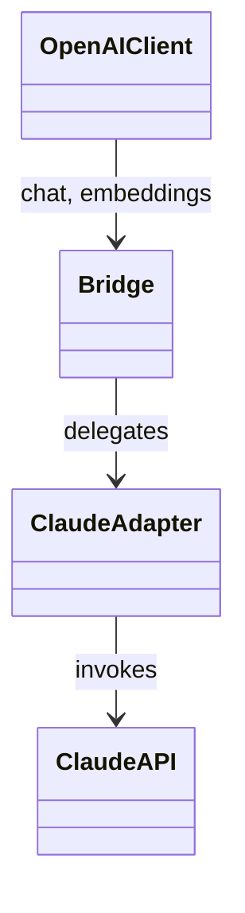
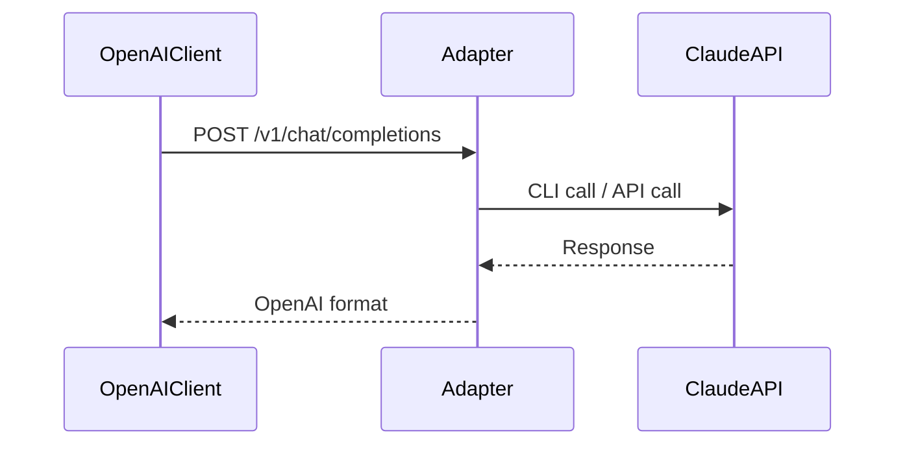
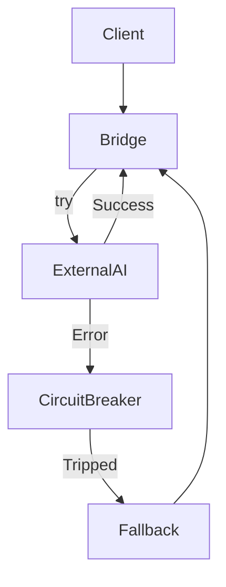
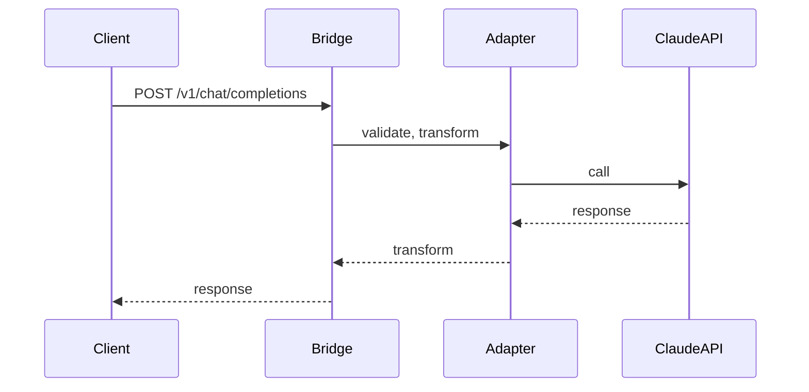
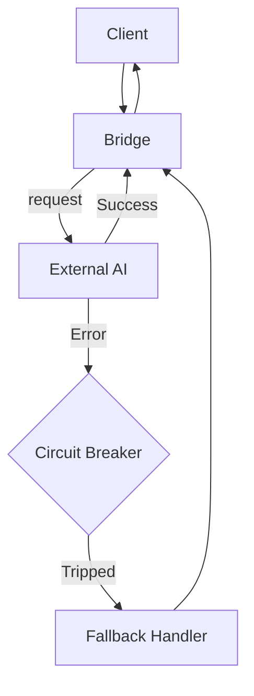

# 📚 Расширенный раздел документации для claude-openai-bridge

---

## 1. Примеры схем типов (JSON Schema, Protobuf)

### Chat Completion (JSON Schema)

```json
{
  "$schema": "http://json-schema.org/draft-07/schema#",
  "type": "object",
  "required": ["model", "messages"],
  "properties": {
    "model": { "type": "string" },
    "messages": {
      "type": "array",
      "items": {
        "type": "object",
        "required": ["role", "content"],
        "properties": {
          "role": { "type": "string", "enum": ["system", "user", "assistant"] },
          "content": { "type": "string" }
        }
      }
    },
    "temperature": { "type": "number", "minimum": 0, "maximum": 2 },
    "stream": { "type": "boolean" }
  }
}
```

### Embeddings (JSON Schema)

```json
{
  "$schema": "http://json-schema.org/draft-07/schema#",
  "type": "object",
  "required": ["model", "input"],
  "properties": {
    "model": { "type": "string" },
    "input": {
      "oneOf": [
        { "type": "string" },
        { "type": "array", "items": { "type": "string" } }
      ]
    }
  }
}
```

### Пример Protobuf для Embeddings

```protobuf
syntax = "proto3";

message EmbeddingRequest {
  string model = 1;
  repeated string input = 2;
}

message EmbeddingResponse {
  repeated float embedding = 1;
}
```

---

## 2. Архитектурные паттерны и anti-patterns

### Bridge Pattern

> Отделяет API-интерфейс OpenAI от реализации Claude, позволяя гибко расширять поддержку новых моделей/AI.



### Adapter Pattern

> Позволяет использовать несовместимые интерфейсы (например, разные форматы сообщений).



### Circuit Breaker

> Прерывает цепочку вызовов при ошибках внешнего AI, предотвращая cascade failures.



#### Anti-patterns

- **God Bridge**: Bridge, содержащий логику адаптации, маршрутизации, бизнес-логику и обработку ошибок в одном месте.  
  _Проблема_: сложно тестировать, невозможно расширять, высокая связанность.
- **Tight Coupling**: Жёсткая связка bridge с конкретным API/AI, невозможность гибкой подмены реализации.

---

## 3. Практические рекомендации по интеграции внешних AI

- **Безопасное хранение секретов**: Используйте переменные окружения и секрет-хранилища (например, Vault, AWS Secrets Manager).
- **Fallback-логика**: Реализуйте резервные сценарии (например, возвращать шаблонный ответ или использовать альтернативный AI).
- **Plug-in архитектура**: Используйте интерфейсы/абстракции для подключения сторонних AI-модулей без изменения основного кода bridge.
- **Расширяемость**: Добавляйте новые модели/AI через регистрацию адаптеров.
- **Валидация схем**: Всегда проверяйте входные/выходные данные через JSON Schema/Protobuf.
- **Rate limiting и circuit breaker**: Ограничивайте частоту запросов и используйте circuit breaker для предотвращения перегрузки.

---

## 4. Примеры юнит- и интеграционных тестов bridge-слоя

### Юнит-тест (Python + pytest, mock endpoint)

```python
def test_bridge_chat_completion(monkeypatch):
    from src.server import app
    from fastapi.testclient import TestClient

    def fake_claude_response(*args, **kwargs):
        return {"choices": [{"message": {"role": "assistant", "content": "Hi!"}}]}

    monkeypatch.setattr("src.server.ClaudeBridgeAdapter.chat", fake_claude_response)
    client = TestClient(app)
    resp = client.post("/v1/chat/completions", json={
        "model": "claude-3-5-sonnet-20241022",
        "messages": [{"role": "user", "content": "Hello"}]
    })
    assert resp.status_code == 200
    assert resp.json()["choices"][0]["message"]["content"] == "Hi!"
```

### Интеграционный тест (Fake endpoint)

```python
def test_embeddings_fake(monkeypatch):
    from src.server import app
    from fastapi.testclient import TestClient

    monkeypatch.setattr("src.server.EmbeddingAdapter.embed", lambda *a, **kw: [0.1, 0.2, 0.3])
    client = TestClient(app)
    resp = client.post("/v1/embeddings", json={"model": "text-embedding-3-small", "input": "test"})
    assert resp.status_code == 200
    assert isinstance(resp.json()["embedding"], list)
```

---

## 5. Централизованное логирование и мониторинг

- Используйте **структурированное логирование** (JSON logs) с обязательными полями: request_id, endpoint, status, latency, error_code.
- Интегрируйте bridge с системами мониторинга (Prometheus, Grafana, Sentry).
- Логируйте все ошибки интеграции, превышения rate limit, circuit breaker trips.
- Для production — используйте ротацию логов, алерты на критические сбои, трассировку запросов (tracing).

---

## 6. Типовые ошибки интеграции и их предотвращение

| Ошибка                              | Причина                                   | Как избежать                              |
|--------------------------------------|-------------------------------------------|-------------------------------------------|
| Invalid API key                     | Неправильный или отсутствующий ключ       | Валидация и fallback на другой AI         |
| Timeout/Rate limit                  | Превышение лимитов или задержка AI        | Circuit breaker + retry + backoff         |
| Schema validation error              | Несовпадение структуры запроса/ответа     | Runtime-валидация схем                    |
| Unexpected response format           | Обновление стороннего API                 | Контрактные тесты, автоматическая валидация|
| Bridge tightly coupled to AI         | Нет абстракции над внешним AI             | Dependency inversion, интерфейсы          |
| Логика bridge не покрыта тестами     | Нет mock/fake endpoint-ов                 | Покрывать все кейсы unit/integration тестами|

---

## 7. Mermaid-диаграммы потоков данных

### Общий поток данных bridge



### Circuit Breaker с fallback



---

## 8. Инструкция по добавлению раздела

1. Если у вас есть директория `docs/`, создайте файл [`docs/claude-openai-bridge.md`](docs/claude-openai-bridge.md) и вставьте туда этот раздел.
2. Если отдельной директории нет — добавьте этот раздел в конец [`README.md`](README.md) или [`CLAUDE.md`](CLAUDE.md), выбрав наиболее подходящий по структуре файл.
3. Для навигации рекомендуется добавить ссылку на раздел в оглавление документации.
4. При необходимости адаптируйте примеры под конкретную реализацию bridge в вашем проекте.

---

**Основано на анализе современных статей и best practices (2022–2025). Всё содержимое практически применимо к claude-openai-bridge.**